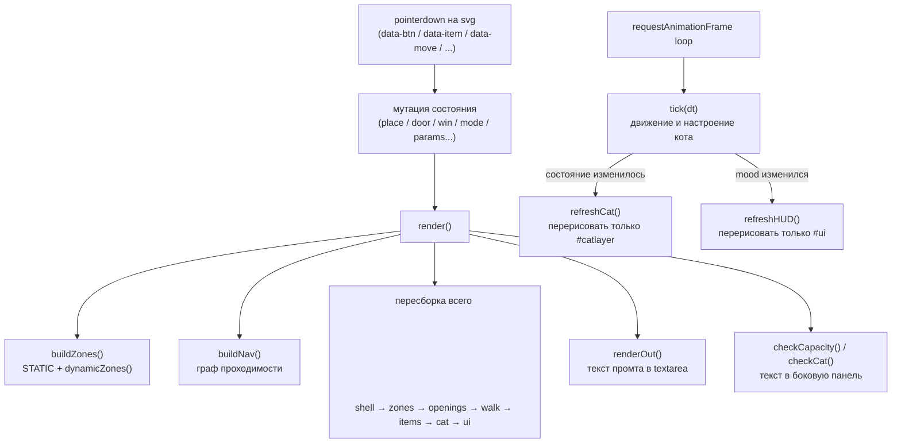

# Архитектура — «Схема зон комнаты»

Карта того, как устроен прототип в [index.html](../index.html) + [app.js](../app.js). Составлена по состоянию проекта на сегодня, после выноса скрипта в отдельный файл (изменений логики не было — только перенос кода).

## Что это

Изначально — инструмент планировки комнаты для генерации промтов под ИИ-арт. За последние правки он дорос до **живого прототипа** самой игры: в комнате теперь есть кот с состояниями (idle/walk/sit/lie/eat/dig/jump), настроение, еда, игрушки, HUD с рыбками/кристаллами — то есть index.html одновременно и инструмент дизайнера, и черновой геймплейный сэмпл.

## Файлы

| Файл | Роль |
|---|---|
| [index.html](../index.html) | Разметка (`.wrap` → `.stage` со сценой + `.side` — боковая панель), вся CSS, один тег `<script src="app.js">` |
| [app.js](../app.js) | Вся логика: 1139 строк, без модулей/сборки — плоский скрипт с глобальным состоянием |

## Ключевая особенность: два слоя интерфейса

1. **Настоящий HTML** — только в `.side` (правая колонка): кнопки двери/окна, блоки `#cap`/`#nav` с текстом, `<textarea id="out">` с промтом, кнопка «Скопировать». Это единственные DOM-элементы вне `<svg>`.
2. **Интерфейс внутри SVG** — HUD (мордочка/настроение/рыбки/кристаллы), кнопки режимов (Настройки/Инвентарь/Корм/Задания/Магазин), сетка инвентаря с пагинацией, панель настроек со слайдерами — всё это **не HTML**, а SVG-фигуры, которые `render()` перерисовывает с нуля при каждом изменении состояния (`app.js:811`). Клики по ним ловит один делегированный `pointerdown` на `<svg>`, различающий цель по `data-*` атрибутам.

Это объясняет, почему в файле нет ни одного `addEventListener("click", ...)` на кнопки — они не существуют как элементы до отрисовки кадра.

## Глобальное состояние

Всё состояние — простые `let`/`const` на верхнем уровне скрипта, без класса/модуля. Главное:

| Переменная | Смысл |
|---|---|
| `params` / `applied` | настройки сцены (размер пола, наклон, зум) — «черновые» и «применённые»; расходятся, когда есть несохранённые правки (`dirty()`) |
| `PROJ` | производные константы изопроекции, пересчитываются `applyProj()` |
| `door`, `win`, `light` | позиции проёма двери/окна/точки потолочного света |
| `place` | **раскладка комнаты**: `{zoneId: itemId}` — что куда поставлено |
| `ZONES` / `ZMAP` | все зоны текущего кадра (статичные + зависящие от двери/окна), пересчитывает `buildZones()` |
| `STATIC` | зоны пола/стен, которые не зависят от двери/окна — генерирует `generateLayout()`, обновляется только по кнопке «Сохранить» |
| `mode` | какая SVG-панель открыта: `view` / `inventory` / `supplies` / `settings` |
| `cat` | позиция, состояние анимации, очередь пути, таймер, реплика |
| `mood`, `fish`, `gems` | показатели тамагочи в HUD |
| `NAV` | граф проходимости пола, пересчитывается в `render()` |

## Модули (по секциям файла)

Секции размечены комментариями `/* ===== ... ===== */` в самом файле; ссылки — на `app.js`.

1. **Проекция** (`app.js:1`) — изометрическая проекция `P()`/`unP()`, SVG-хелпер `el()`, утилиты (`clamp`, `poly`, `centroid`).
2. **Каталог предметов** (`app.js:37`) — `ITEMS` (23 предмета: категория, размер, EN-описание для промта), `SUPPLIES` (корм/игрушки), `SAY` (реплики кота).
3. **Генератор раскладки** (`app.js:77`, `generateLayout`) — считает зоны пола (`STATIC`) так, чтобы они помещались в видимую область при текущих `floor/tilt/zoom`. Единственное место, которое подстраивается под размер сцены.
4. **Зоны у двери/окна** (`app.js:142`, `dynamicZones` + `app.js:196`, `buildZones`) — зоны стен и «заблокированный» коридор к двери пересчитываются каждый кадр, в отличие от `STATIC`.
5. **Правила размещения** (`app.js:218`, `reject`) — можно ли поставить предмет в зону: категория/полоса (`ACCEPTS`), габариты, перекрытие окна, блокировка прохода.
6. **Проходимость / навигация** (`app.js:235`) — `footprint()` даёт занятый мебелью прямоугольник, `buildNav()` строит сетку `STEP=0.25` и находит связные области (BFS/flood fill) — отсюда «% свободного пола» и «кот не пройдёт». `findPath()` (`app.js:281`) — BFS кратчайший путь для перемещения кота.
7. **Кот: конечный автомат** (`app.js:319`) — состояния `idle/sit/lie/walk/eat/dig/jump`, переходы `idleCycle → wander → walkTo`, реакции на еду/игрушку (`feedHand/feedBowl/feedFloor/playHand`). `tick(dt)` в `app.js:1123` двигает кота и меняет настроение.
8. **Отрисовка сцены** — стены/пол (`drawShell`), проёмы (`drawOpenings`), объёмный «бокс» предмета (`box`), оверлей проходимости (`drawWalk`), сам кот как процедурная векторная фигура (`drawCat`), потолочный светильник (`drawCeil`), предмет в зоне (`drawItem`).
9. **Иконки предметов** (`icon()`) — один большой `switch` по `id`, рисует мини-глиптограммы для карточек в инвентаре/кормах.
10. **SVG-интерфейс** — `panelGeo()` считает трапеции панелей под сценой, `drawButtons`/`drawList` (инвентарь с пагинацией и жестами), `drawHUD`/`catFace` (полоса настроения, рыбки, кристаллы), `drawSettings` (слайдеры сцены + переключатели + кнопка «Сохранить»).
11. **Сборка кадра** (`app.js:811`, `render()`) — центральная функция: пересчитывает проекцию/зоны, полностью очищает и заново строит `<svg>` слоями (`shell → zones → openings → walk → items → cat → draglayer → ui`), затем обновляет текст промта (`renderOut`), боковые подсказки (`checkCapacity`, `checkCat`) и состояние HTML-кнопок (`syncControls`). `refreshCat()`/`refreshHUD()` — частичные перерисовки только своего слоя, чтобы анимация не пересобирала всю сцену на каждый кадр.
12. **Ввод** (`app.js:904`) — один `pointerdown` на `<svg>`, диспетчеризация по `data-slider/-page/-btn/-cell/-move/-item`; кастомный drag&drop без HTML5 DnD API (через pointer-события и `#draglayer`-«призрак»); перетаскивание двери/окна/кота/света прямо по сцене (`startMove`); свайп-жесты по карточкам инвентаря (`cellGesture`). Несколько настоящих HTML-кнопок в сайдбаре навешивают обработчики отдельно, в конце файла.
13. **Игровой цикл** (`app.js:1123`) — `requestAnimationFrame`, двигает кота через `tick(dt)`, перерисовывает слой кота только при изменении «ключа» состояния (позиция/фаза/реплика), HUD — только при изменении отображаемого `mood`.

## Поток данных за один кадр

## На заметку

- Модулей/сборки нет: `app.js` — один файл, всё в глобальной области видимости. Для текущего размера (1139 строк) это работает, но при дальнейшем росте (квесты, магазин — кнопки-заглушки уже есть: `RBTN` содержит `quests`/`shop`) стоит подумать о разбиении хотя бы на пару файлов (данные/каталог отдельно от рендера).
- `STATIC` (не зависящие от двери/окна зоны) пересчитывается только по кнопке «Сохранить» в настройках — это осознанное решение (не дёргать раскладку при каждом движении слайдера), но об этом стоит помнить при отладке несовпадения зон.
- Раздельные файлы теперь можно кэшировать браузером независимо и удобнее смотреть в диффах — сам `index.html` больше не меняется при правках логики.
